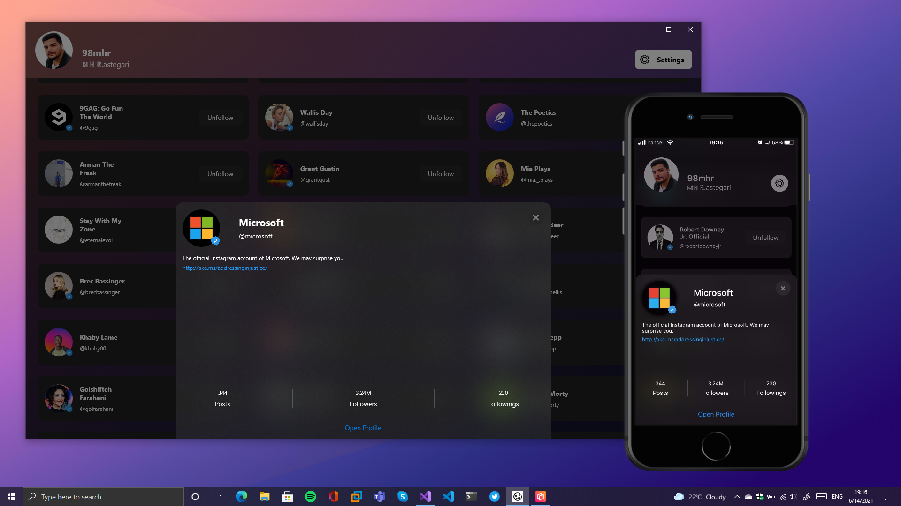
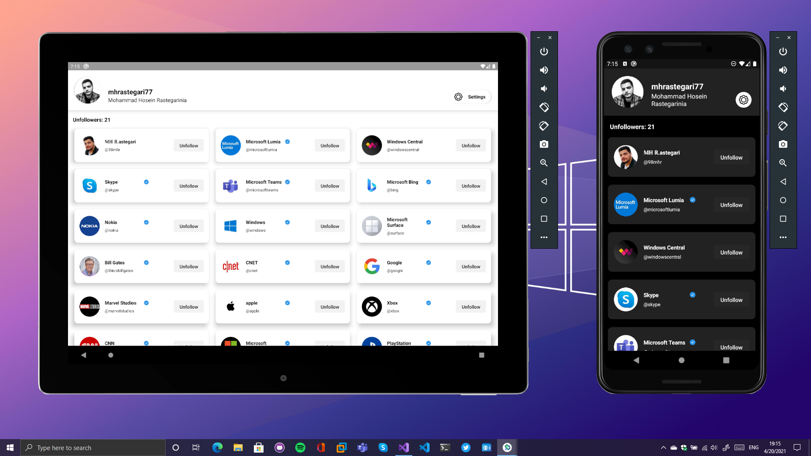
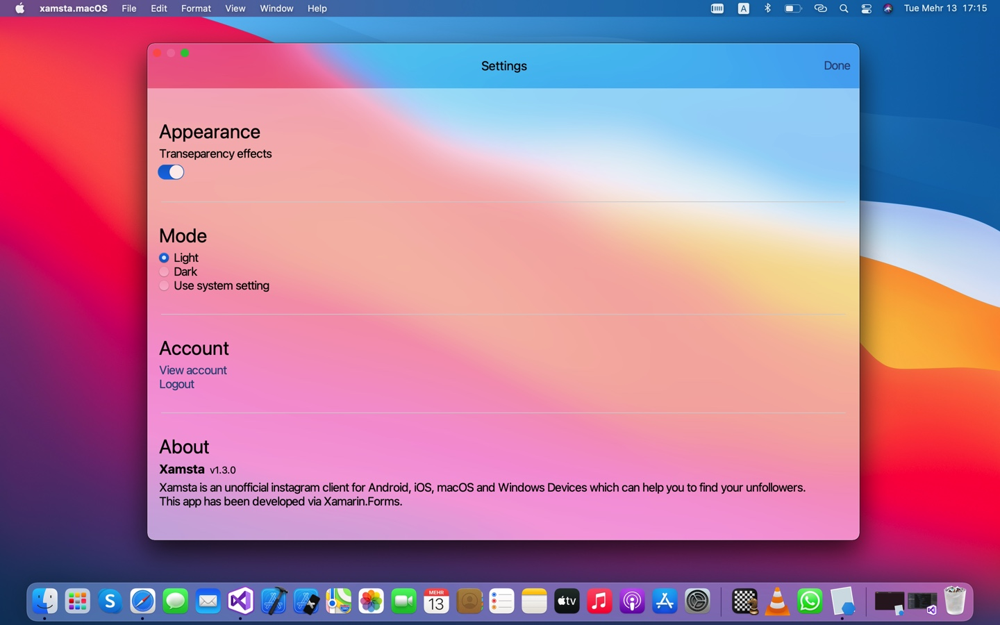

# Xamsta

Xamsta is an unofficial instagram client for iOS, macOS, Android and Windows Devices which can help you to find your unfollowers.
This app has been developed via [Xamarin.Forms][8].

# Screenshots

  
  
  

# Support platforms

- [x] iOS
- [x] macOS
- [x] Android
- [x] UWP (Min Target: 10.0.17763)

# Contact me in

- LinkedIn: [MH Rastegari][10]
- Twitter: [@mhrastegari77][11]
- Telegram: [@mhrastegari77][12]

# Special thanks to

1. [Instagram Api Sharp][1]
2. [Sharpnado Material Frame][2]
3. [RG Plugins Popup][3]
4. [Xamarin Community Toolkit][4]
5. [Forms Nuke][5]
6. [Glidex Froms][6]
7. [Resizetizer NT][7]
8. [ContextMenuContainer][9]

[1]: https://github.com/ramtinak/InstagramApiSharp/
[2]: https://github.com/roubachof/Sharpnado.MaterialFrame
[3]: https://github.com/rotorgames/Rg.Plugins.Popup
[4]: https://github.com/xamarin/XamarinCommunityToolkit
[5]: https://github.com/roubachof/Xamarin.Forms.Nuke
[6]: https://github.com/jonathanpeppers/glidex/
[7]: https://github.com/redth/Resizetizer
[8]: https://github.com/xamarin/Xamarin.Forms/
[9]: https://github.com/anpin/ContextMenuContainer
[10]: https://www.linkedin.com/in/mhrastegari77/
[11]: https://twitter.com/mhrastegari77
[12]: https://telegram.me/mhrastegari77
