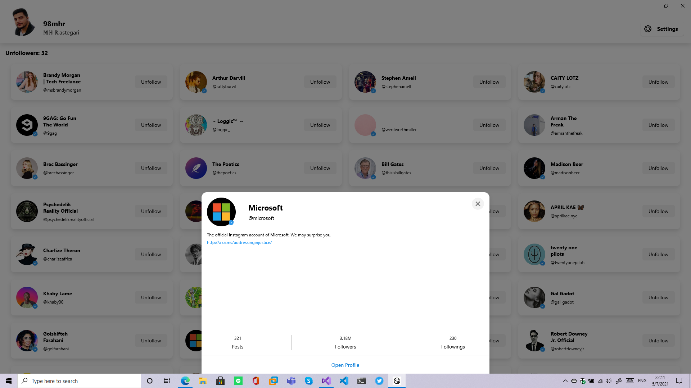
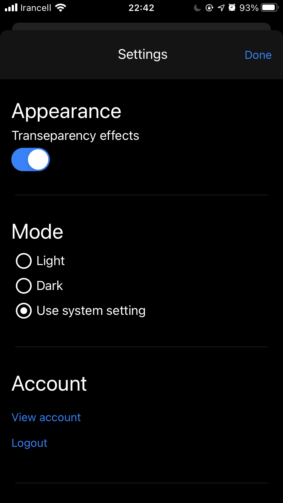

# Xamsta
Xamsta is an unofficial instagram client for iOS, macOS, Android and Windows 10 Devices which can help you to find your unfollowers.
This app has been developed via [Xamarin.Forms][8].

# Screenshots

  
  
  

# Special thanks to
1. [Instagram Api Sharp][1]
2. [Sharpnado Material Frame][2]
3. [RG Plugins Popup][3]
4. [Xamarin Community Toolkit][4]
5. [Forms Nuke][5]
6. [Glidex Froms][6]
7. [Resizetizer NT][7]

 [1]: https://github.com/ramtinak/InstagramApiSharp/
 [2]: https://github.com/roubachof/Sharpnado.MaterialFrame
 [3]: https://github.com/rotorgames/Rg.Plugins.Popup
 [4]: https://github.com/xamarin/XamarinCommunityToolkit
 [5]: https://github.com/roubachof/Xamarin.Forms.Nuke
 [6]: https://github.com/jonathanpeppers/glidex/
 [7]: https://github.com/redth/Resizetizer
 [8]: https://github.com/xamarin/Xamarin.Forms/
